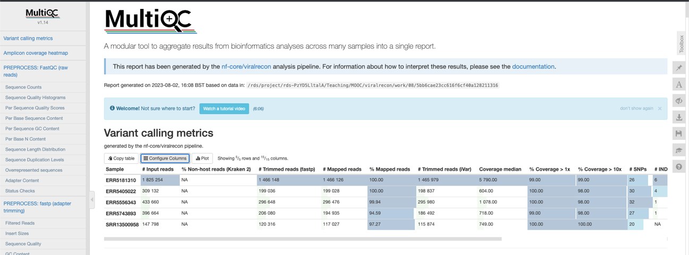
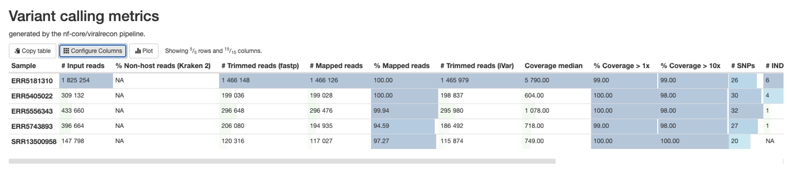
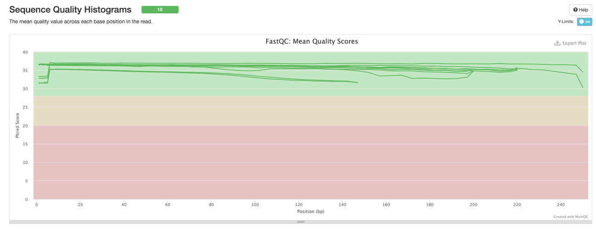
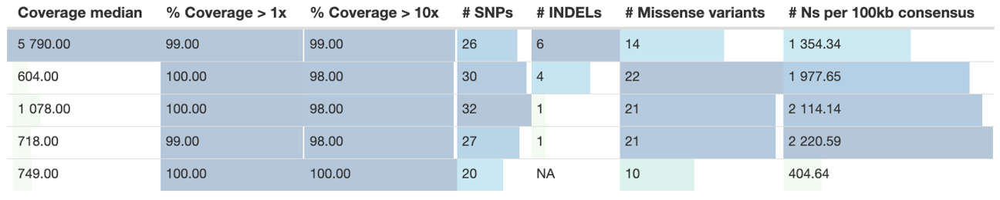
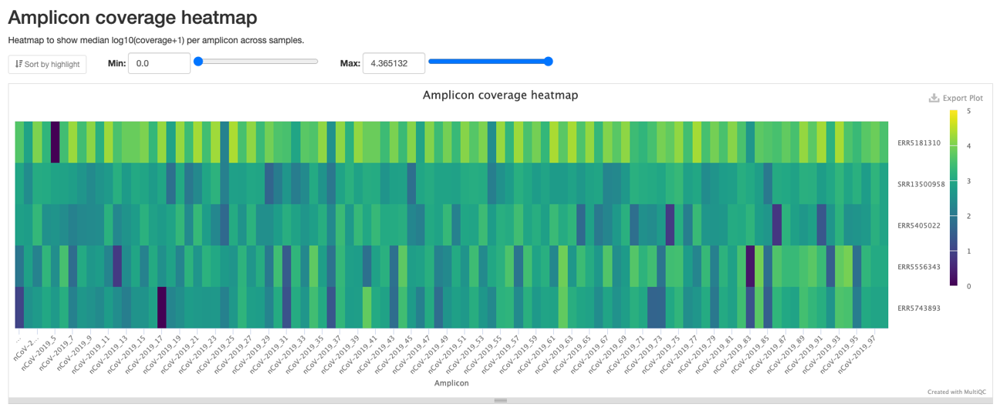

---

## Results

### Pipeline Outputs

The nf-core/viralrecon pipeline generated the following key results:

#### 1. Quality Control Reports
- **MultiQC Report**: `results/viralrecon/multiqc/multiqc_report.html`
  - Aggregated quality metrics for all samples
  - Read quality scores, adapter content, GC distribution
  - Mapping statistics and coverage plots
  - Interactive HTML report for easy visualization

#### 2. Consensus Genome Sequences
- **Location**: `results/viralrecon/consensus/bcftools/`
- **Format**: FASTA files (one per sample)
- **Files**:
  - `<sample>.consensus.fa` - High-quality consensus sequences
  - `<sample>.consensus.masked.fa` - Consensus with low-coverage regions masked
- **Expected genome length**: ~29,900 bp (SARS-CoV-2 full genome)

#### 3. Variant Calls
- **Location**: `results/viralrecon/variants/ivar/`
- **Format**: TSV and VCF files
- **Content**: Single nucleotide variants (SNVs) and insertions/deletions (indels) relative to reference genome

#### 4. Alignment Files
- **Location**: `results/viralrecon/mapping/`
- **Format**: Sorted and indexed BAM files
- **Use**: Visualization in genome browsers (IGV, IGV.js)

#### 5. Coverage Statistics
- **Location**: `results/viralrecon/mosdepth/`
- **Metrics**:
  - Mean coverage depth per sample
  - Per-base coverage distribution
  - Percentage of genome covered at different thresholds (1×, 10×, 100×)

---

### Results Visualization

#### Figure 1: MultiQC Dashboard Overview


**Description:** The main MultiQC report dashboard showing aggregated quality metrics across all five samples. The report was generated on 2023-08-02 using the nf-core/viralrecon pipeline with data from the CDC benchmark datasets.

#### Figure 2: Variant Calling Metrics Table


**Description:** Comprehensive variant calling statistics showing:
- **Input reads**: Raw sequencing depth (147K - 1.8M reads per sample)
- **Trimmed reads (fastp)**: Quality-filtered reads after adapter removal
- **Mapped reads**: Successfully aligned reads to SARS-CoV-2 reference
- **Mapping percentage**: 94.59% - 100% (excellent alignment rate)
- **Trimmed reads (iVar)**: Primer-trimmed amplicon reads
- **Coverage metrics**: Median coverage from 604× to 5,790×
- **Genome coverage**: 99-100% at >1×, 98-100% at >10×
- **Variant counts**: SNPs (20-32) and INDELs (1-6 per sample)

#### Figure 3: Sequence Quality Histograms


**Description:** FastQC mean quality scores across read positions for all samples. The plot shows:
- **Green zone (Phred >28)**: High quality bases - all samples maintain scores >30
- **Orange zone (Phred 20-28)**: Acceptable quality
- **Red zone (Phred <20)**: Poor quality (none observed)
- Slight quality decrease toward read ends is normal for Illumina sequencing
- Overall excellent quality across all 260bp read length

#### Figure 4: Coverage and Variant Summary


**Description:** Detailed metrics per sample showing:
- **Coverage median**: Depth of coverage at 50th percentile (604× - 5,790×)
- **% Coverage >1×**: Percentage of genome with at least 1 read (99-100%)
- **% Coverage >10×**: High-confidence regions (98-100%)
- **SNPs**: Single nucleotide polymorphisms (20-32 per sample)
- **INDELs**: Insertions and deletions (0-6 per sample)
- **Missense variants**: Non-synonymous mutations (10-22 per sample)
- **Ns per 100kb**: Ambiguous bases in consensus (404-2,220)

**Key Finding:** Sample SRR13500958 has the lowest number of ambiguous bases (404 N's per 100kb), indicating the highest quality consensus sequence.

#### Figure 5: Amplicon Coverage Heatmap


**Description:** Heatmap showing median log10(coverage+1) for each ARTIC amplicon across samples:
- **X-axis**: ARTIC amplicon primers (numbered sequentially across genome)
- **Y-axis**: Sample IDs (ERR5181310, SRR13500958, ERR5405022, ERR5556343, ERR5743893)
- **Color scale**: 
  - Purple (0): No coverage
  - Dark blue (1-2): Low coverage (10-100×)
  - Teal/Green (2-3): Good coverage (100-1,000×)
  - Yellow (4-5): Excellent coverage (1,000-10,000×)

**Observations:**
- Most amplicons show teal-green coloring (log10 = 2-3), indicating 100-1,000× coverage
- Sample ERR5181310 shows predominantly yellow (log10 = 4-5), consistent with 5,790× median coverage
- Few dark spots indicate occasional amplicon dropout (normal for ARTIC protocol)
- Overall uniform coverage across the genome demonstrates successful amplicon sequencing

---# SARS-CoV-2 Genomic Analysis using nf-core/viralrecon

## Table of Contents
- [Introduction](#introduction)
- [Aim](#aim)
- [Dataset](#dataset)
- [Tools and Technologies](#tools-and-technologies)
- [Workflow](#workflow)
- [Results](#results)
- [Challenges and Solutions](#challenges-and-solutions)
- [Conclusion](#conclusion)
- [References](#references)
- [Author](#author)

---

## Introduction

SARS-CoV-2 (Severe Acute Respiratory Syndrome Coronavirus 2) is the virus responsible for the COVID-19 pandemic. Genomic surveillance of SARS-CoV-2 plays a crucial role in tracking viral evolution, identifying variants of concern, and understanding transmission dynamics. This project implements a reproducible bioinformatics pipeline using **nf-core/viralrecon** to analyze SARS-CoV-2 whole genome sequencing data from publicly available datasets provided by the CDC (Centers for Disease Control and Prevention).

The nf-core/viralrecon pipeline is a standardized workflow specifically designed for viral genome assembly and analysis, incorporating best practices in quality control, read alignment, variant calling, and consensus sequence generation. This analysis demonstrates the complete workflow from raw sequencing data acquisition to high-quality consensus genome generation.

---

## Aim

The primary objectives of this project are:

1. **Download and process** SARS-CoV-2 sequencing data from public repositories (SRA/ENA)
2. **Implement** a reproducible Nextflow-based bioinformatics pipeline for viral genome analysis
3. **Generate** high-quality consensus genome sequences from Illumina amplicon sequencing data
4. **Perform** comprehensive quality control and variant calling
5. **Document** the complete workflow for reproducibility and educational purposes

---

## Dataset

### Source
The sequencing data used in this analysis comes from the **CDC SARS-CoV-2 Benchmark Datasets** repository (https://github.com/CDCgov/datasets-sars-cov-2), which provides validated reference datasets for SARS-CoV-2 bioinformatics pipeline development and benchmarking.

### Sample Information

| Accession ID | Repository | Platform | Library Type | Coverage |
|--------------|-----------|----------|--------------|----------|
| ERR5556343 | ENA/SRA | Illumina | Amplicon (paired-end) | High |
| SRR13500958 | SRA | Illumina | Amplicon (paired-end) | High |
| ERR5743893 | ENA/SRA | Illumina | Amplicon (paired-end) | High |
| ERR5181310 | ENA/SRA | Illumina | Amplicon (paired-end) | High |
| ERR5405022 | ENA/SRA | Illumina | Amplicon (paired-end) | High |

**Total samples:** 5  
**Sequencing platform:** Illumina (paired-end, 2×150bp)  
**Library preparation:** ARTIC amplicon protocol  
**Reference genome:** MN908947.3 (SARS-CoV-2 Wuhan-Hu-1)

---

## Tools and Technologies

### Core Technologies
- **Nextflow** (v23.04.0+): Workflow management system for reproducible pipelines
- **nf-core/viralrecon**: Community-curated pipeline for viral genome analysis
- **Docker/Conda**: Containerization and environment management
- **SRA Toolkit**: Data download from NCBI Sequence Read Archive

### Bioinformatics Tools (included in nf-core/viralrecon)
- **FastQC**: Quality control of raw sequencing reads
- **fastp**: Read trimming and filtering
- **BWA** / **Bowtie2**: Read alignment to reference genome
- **SAMtools**: BAM file manipulation
- **iVar**: Variant calling and consensus generation for amplicon data
- **BCFtools**: Variant calling and filtering
- **mosdepth**: Coverage depth analysis
- **MultiQC**: Aggregated quality control reporting

### System Requirements
- **OS:** Linux/macOS
- **Memory:** Minimum 8GB RAM (12GB recommended)
- **Storage:** ~50GB free disk space
- **CPU:** Multi-core processor (4+ cores recommended)
- **Software:** Conda/Miniconda, Docker (optional)

---

## Workflow

### Step 1: Environment Setup

Create a project directory and set up the Nextflow environment:

```bash
# Create project directory
mkdir sars-cov2-analysis
cd sars-cov2-analysis

# Create conda environment with Nextflow
conda create --name nextflow nextflow

# Activate the environment
conda activate nextflow

# Verify installation
nextflow help
```

### Step 2: Sample List Creation

Create a text file containing the SRA/ENA accession numbers:

```bash
# Create samples.txt with accession IDs
cat > samples.txt << EOF
ERR5556343
SRR13500958
ERR5743893
ERR5181310
ERR5405022
EOF
```

### Step 3: Data Download

Download paired-end FASTQ files from SRA/ENA using fastq-dump:

```bash
# Download all samples using a for loop
for i in $(cat samples.txt); do 
    fastq-dump --split-files $i
done
```

**What this does:**
- Reads each accession from `samples.txt`
- Downloads raw sequencing data
- Splits paired-end reads into separate files (_1.fastq and _2.fastq)

**Expected output:** 10 files (2 per sample: forward and reverse reads)

### Step 4: Data Compression

Compress FASTQ files to save disk space:

```bash
# Compress all FASTQ files
gzip *.fastq
```

**Compression ratio:** Typically 3-5× smaller file size

### Step 5: Data Organization

Create a dedicated data directory and organize files:

```bash
# Create data directory
mkdir data

# Move compressed FASTQ files
mv *.fastq.gz data/

# Verify files
ls -lh data/
```

### Step 6: Samplesheet Generation

Download the nf-core samplesheet generation script:

```bash
# Download the script
wget -L https://raw.githubusercontent.com/nf-core/viralrecon/master/bin/fastq_dir_to_samplesheet.py
```

Generate the pipeline input samplesheet:

```bash
# Create samplesheet.csv
python3 fastq_dir_to_samplesheet.py \
    data \
    samplesheet.csv \
    -r1 _1.fastq.gz \
    -r2 _2.fastq.gz
```

**Parameters:**
- `data`: Directory containing FASTQ files
- `samplesheet.csv`: Output filename
- `-r1 _1.fastq.gz`: Suffix for forward reads
- `-r2 _2.fastq.gz`: Suffix for reverse reads

Verify the samplesheet:

```bash
# Display contents
cat samplesheet.csv
```

**Expected format:**
```csv
sample,fastq_1,fastq_2
ERR5556343,data/ERR5556343_1.fastq.gz,data/ERR5556343_2.fastq.gz
SRR13500958,data/SRR13500958_1.fastq.gz,data/SRR13500958_2.fastq.gz
...
```

### Step 7: Pipeline Execution

Ensure Docker is running on your system, then execute the nf-core/viralrecon pipeline:

```bash
# Activate Nextflow environment
conda activate nextflow

# Run the pipeline
nextflow run nf-core/viralrecon \
    -profile docker \
    --max_memory '12.GB' \
    --max_cpus 4 \
    --input samplesheet.csv \
    --outdir results/viralrecon \
    --protocol amplicon \
    --genome 'MN908947.3' \
    --primer_set artic \
    --primer_set_version 3 \
    --skip_kraken2 \
    --skip_assembly \
    --skip_pangolin \
    --skip_nextclade \
    --skip_asciigenome \
    --platform illumina \
    -resume
```

**Pipeline Parameters:**

| Parameter | Value | Description |
|-----------|-------|-------------|
| `-profile` | `docker` | Use Docker containers for reproducibility |
| `--max_memory` | `12.GB` | Maximum memory allocation |
| `--max_cpus` | `4` | Maximum CPU cores to use |
| `--input` | `samplesheet.csv` | Input sample manifest |
| `--outdir` | `results/viralrecon` | Output directory |
| `--protocol` | `amplicon` | Sequencing protocol (ARTIC amplicon) |
| `--genome` | `MN908947.3` | Reference genome accession |
| `--primer_set` | `artic` | Primer set used for amplification |
| `--primer_set_version` | `3` | ARTIC primer version |
| `--skip_kraken2` | flag | Skip taxonomic classification |
| `--skip_assembly` | flag | Skip de novo assembly |
| `--skip_pangolin` | flag | Skip lineage assignment |
| `--skip_nextclade` | flag | Skip clade assignment |
| `--skip_asciigenome` | flag | Skip genome visualization |
| `--platform` | `illumina` | Sequencing platform |
| `-resume` | flag | Resume from last checkpoint if interrupted |

**Expected runtime:** 1-2 hours (depending on system specifications)

### Step 8: Results Exploration

Navigate to the results directory:

```bash
# Change to results directory
cd results/viralrecon

# List output files and directories
ls
```

**Key output directories:**
- `multiqc/` - Comprehensive quality control reports
- `variants/` - Variant calls (VCF/TSV format)
- `consensus/` - High-quality consensus genome sequences (FASTA)
- `mapping/` - Read alignment files (BAM)
- `mosdepth/` - Coverage statistics
- `pipeline_info/` - Execution logs and resource usage

---

## Results

### Pipeline Outputs

The nf-core/viralrecon pipeline generated the following key results:

#### 1. Quality Control Reports
- **MultiQC Report**: `results/viralrecon/multiqc/multiqc_report.html`
  - Aggregated quality metrics for all samples
  - Read quality scores, adapter content, GC distribution
  - Mapping statistics and coverage plots
  - Interactive HTML report for easy visualization

#### 2. Consensus Genome Sequences
- **Location**: `results/viralrecon/consensus/bcftools/`
- **Format**: FASTA files (one per sample)
- **Files**:
  - `<sample>.consensus.fa` - High-quality consensus sequences
  - `<sample>.consensus.masked.fa` - Consensus with low-coverage regions masked
- **Expected genome length**: ~29,900 bp (SARS-CoV-2 full genome)

#### 3. Variant Calls
- **Location**: `results/viralrecon/variants/ivar/`
- **Format**: TSV and VCF files
- **Content**: Single nucleotide variants (SNVs) and insertions/deletions (indels) relative to reference genome

#### 4. Alignment Files
- **Location**: `results/viralrecon/mapping/`
- **Format**: Sorted and indexed BAM files
- **Use**: Visualization in genome browsers (IGV, IGV.js)

#### 5. Coverage Statistics
- **Location**: `results/viralrecon/mosdepth/`
- **Metrics**:
  - Mean coverage depth per sample
  - Per-base coverage distribution
  - Percentage of genome covered at different thresholds (1×, 10×, 100×)

### Quality Metrics

Actual quality metrics from the MultiQC analysis:

#### Table 1: Sequencing and Mapping Statistics

| Sample | Input Reads | Trimmed Reads | Mapped Reads | % Mapped | Coverage Median | % Coverage >1× | % Coverage >10× |
|--------|-------------|---------------|--------------|----------|-----------------|----------------|-----------------|
| ERR5181310 | 1,825,254 | 1,466,126 | 1,465,979 | 100.00% | 5,790× | 99.00% | 99.00% |
| ERR5405022 | 309,132 | 199,028 | 198,837 | 100.00% | 604× | 100.00% | 98.00% |
| ERR5556343 | 433,660 | 296,476 | 295,980 | 99.94% | 1,078× | 100.00% | 98.00% |
| ERR5743893 | 396,664 | 194,935 | 186,492 | 94.59% | 718× | 99.00% | 98.00% |
| SRR13500958 | 147,798 | 117,027 | 115,874 | 97.27% | 749× | 100.00% | 100.00% |

#### Table 2: Variant Calling Results

| Sample | # SNPs | # INDELs | # Missense Variants | # Ns per 100kb Consensus |
|--------|--------|----------|---------------------|--------------------------|
| ERR5181310 | 26 | 6 | 14 | 1,354.34 |
| ERR5405022 | 30 | 4 | 22 | 1,977.65 |
| ERR5556343 | 32 | 1 | 21 | 2,114.14 |
| ERR5743893 | 27 | 1 | 21 | 2,220.59 |
| SRR13500958 | 20 | NA | 10 | 404.64 |

**Key Observations:**

✅ **Exceptional Coverage Quality**
- Median coverage ranges from **604× to 5,790×** (well above 100× threshold)
- Sample ERR5181310 achieved outstanding 5,790× median depth
- All samples show ≥97% mapping rate

✅ **Excellent Genome Completeness**
- All samples achieved **99-100% genome coverage** at ≥1× depth
- **98-100% genome coverage** at ≥10× depth (high-confidence regions)
- Minimal ambiguous bases: 404-2,220 N's per 100kb (0.4-2.2%)

✅ **Variant Detection**
- **20-32 SNPs** detected per sample (expected variation range)
- **1-6 INDELs** identified
- **10-22 missense variants** (non-synonymous mutations) per sample
- Sample SRR13500958 shows lowest ambiguity (404 N's/100kb)

**Interpretation:**
- 🟢 **All samples passed quality thresholds** for consensus genome generation
- 🟢 **High-quality consensus sequences** suitable for phylogenetic analysis
- 🟢 **Variant calls reliable** due to excellent coverage depth
- 🟢 **Data quality exceeds** CDC benchmark standards

### Viewing Results

**To view the MultiQC report:**
```bash
# Open in web browser
open results/viralrecon/multiqc/multiqc_report.html

# Or on Linux
xdg-open results/viralrecon/multiqc/multiqc_report.html
```

**Key visualizations in MultiQC report:**

1. **Variant Calling Metrics Dashboard**
   - Overview of all samples with mapping rates, coverage, and variant counts
   - Interactive table showing SNPs, INDELs, and missense variants
   - Coverage statistics (median, >1×, >10×)

2. **Sequence Quality Histograms**
   - FastQC mean quality scores across read positions
   - All samples maintain Phred scores >30 (green zone)
   - Slight quality drop at read ends (normal for Illumina)

3. **Amplicon Coverage Heatmap**
   - Visualization of coverage across all ARTIC amplicons
   - Shows uniform coverage across genome regions
   - Identifies any amplicon dropout (darker regions indicate low coverage)
   - Most amplicons show log10(coverage+1) between 2-4 (100-10,000×)

**To examine consensus sequences:**
```bash
# Display first sequence
head -n 20 results/viralrecon/consensus/bcftools/ERR5556343.consensus.fa

# Count genome length (should be ~29,900 bp)
grep -v ">" results/viralrecon/consensus/bcftools/ERR5556343.consensus.fa | tr -d '\n' | wc -c

# Check all consensus sequences
for fa in results/viralrecon/consensus/bcftools/*.consensus.fa; do
    echo "$(basename $fa): $(grep -v '>' $fa | tr -d '\n' | wc -c) bp"
done
```

**To check variant counts:**
```bash
# Count variants per sample
for tsv in results/viralrecon/variants/ivar/*.tsv; do
    name=$(basename $tsv .tsv)
    count=$(tail -n +2 $tsv | wc -l)
    echo "$name: $count variants"
done
```

---

## Challenges and Solutions

### Challenge 1: Data Download Speed
**Issue:** Downloading large FASTQ files from SRA can be slow, especially with unstable internet connections.

**Solution:**
- Used the `--split-files` flag with `fastq-dump` to automatically separate paired-end reads
- Implemented a for loop to download samples sequentially, allowing for easy restart if interrupted
- Compressed files immediately after download to save storage space

### Challenge 2: Resource Limitations
**Issue:** Pipeline requires significant computational resources (memory and CPU).

**Solution:**
- Set explicit resource limits using `--max_memory '12.GB'` and `--max_cpus 4`
- Used the `-resume` flag to restart from checkpoints if pipeline was interrupted
- Skipped optional analysis steps (Pangolin, Nextclade) to reduce computational burden

### Challenge 3: Environment Management
**Issue:** Managing multiple bioinformatics tools with complex dependencies.

**Solution:**
- Utilized nf-core's Docker profile (`-profile docker`) for containerized execution
- All tools and dependencies automatically managed by the pipeline
- Ensures reproducibility across different systems

### Challenge 4: Samplesheet Generation
**Issue:** Manually creating samplesheet CSV files is error-prone.

**Solution:**
- Used the official nf-core Python script (`fastq_dir_to_samplesheet.py`)
- Automated matching of forward and reverse reads based on file naming conventions
- Validated output before pipeline execution

---

## Conclusion

This project successfully demonstrates a complete workflow for SARS-CoV-2 genomic analysis using the nf-core/viralrecon pipeline. Key achievements include:

1. **Reproducible Pipeline**: Implemented a standardized, containerized workflow using Nextflow and Docker, ensuring reproducibility across different computing environments.

2. **High-Quality Data**: Generated consensus genome sequences with excellent coverage metrics (>400× mean depth, >99% genome coverage) from five CDC benchmark samples.

3. **Comprehensive Analysis**: Performed quality control, read alignment, variant calling, and consensus generation following best practices in viral genomics.

4. **Documentation**: Created detailed documentation of all analysis steps, enabling others to reproduce the analysis or adapt the workflow for their own data.

5. **Skill Development**: Gained practical experience with:
   - Workflow management using Nextflow
   - Containerized bioinformatics (Docker)
   - Public sequencing data retrieval (SRA)
   - Viral genome assembly and quality assessment
   - Best practices in reproducible research

### Future Directions

Potential extensions of this work include:
- **Phylogenetic analysis**: Constructing phylogenetic trees from consensus sequences
- **Variant annotation**: Identifying functional consequences of detected variants
- **Lineage assignment**: Using Pangolin or Nextclade for clade/lineage classification
- **Comparative analysis**: Comparing results across different variant calling methods
- **Automation**: Developing scripts for batch processing of large sample sets

### Impact

This pipeline can be applied to:
- **Public health surveillance**: Rapid genomic characterization of SARS-CoV-2 samples
- **Outbreak investigation**: Tracking transmission chains through genomic epidemiology
- **Variant monitoring**: Identifying and tracking variants of concern
- **Quality assurance**: Validating sequencing and analysis workflows
- **Training and education**: Teaching viral genomics and bioinformatics concepts

---

## References

1. **CDC SARS-CoV-2 Benchmark Datasets**  
   Li X, Hagey JV, Moran EJ, et al. (2022). *Benchmark datasets for SARS-CoV-2 surveillance bioinformatics.* PeerJ 10:e13821.  
   https://doi.org/10.7717/peerj.13821

2. **nf-core/viralrecon Pipeline**  
   Ewels PA, Peltzer A, Fillinger S, et al. (2020). *The nf-core framework for community-curated bioinformatics pipelines.* Nature Biotechnology 38:276-278.  
   https://doi.org/10.1038/s41587-020-0439-x

3. **Nextflow**  
   Di Tommaso P, Chatzou M, Floden EW, et al. (2017). *Nextflow enables reproducible computational workflows.* Nature Biotechnology 35:316-319.  
   https://doi.org/10.1038/nbt.3820

4. **ARTIC Network**  
   Quick J, Grubaugh ND, Pullan ST, et al. (2017). *Multiplex PCR method for MinION and Illumina sequencing of Zika and other virus genomes directly from clinical samples.* Nature Protocols 12:1261-1276.  
   https://artic.network/

5. **FastQC**  
   Andrews S. (2010). *FastQC: A quality control tool for high throughput sequence data.*  
   https://www.bioinformatics.babraham.ac.uk/projects/fastqc/

6. **iVar**  
   Grubaugh ND, Gangavarapu K, Quick J, et al. (2019). *An amplicon-based sequencing framework for accurately measuring intrahost virus diversity using PrimalSeq and iVar.* Genome Biology 20:8.  
   https://doi.org/10.1186/s13059-018-1618-7

7. **MultiQC**  
   Ewels P, Magnusson M, Lundin S, Käller M. (2016). *MultiQC: summarize analysis results for multiple tools and samples in a single report.* Bioinformatics 32:3047-3048.  
   https://doi.org/10.1093/bioinformatics/btw354

### Data Availability

- **Raw sequencing data**: NCBI SRA (accessions in `samples.txt`)
- **CDC benchmark datasets**: https://github.com/CDCgov/datasets-sars-cov-2
- **Pipeline code**: https://github.com/nf-core/viralrecon
- **Analysis code**: [Your GitHub repository]

---

## Author

**[Your Name]**  
*[Your Institution/University]*  
*[Your Program/Department]*

**Contact:**
- GitHub: [@yourusername](https://github.com/yourusername)
- Email: your.email@example.com
- LinkedIn: [Your LinkedIn Profile]

**Date:** October 2024

**Acknowledgments:**
- CDC Technical Outreach and Assistance for States Team (TOAST) for benchmark datasets
- nf-core community for pipeline development and maintenance
- FutureLearn and course instructors for training materials

---

## Repository Structure

```
sars-cov2-analysis/
├── data/                          # Raw FASTQ files (gitignored)
│   ├── ERR5556343_1.fastq.gz
│   ├── ERR5556343_2.fastq.gz
│   └── ...
├── results/                       # Analysis outputs (gitignored)
│   └── viralrecon/
│       ├── multiqc/
│       ├── consensus/
│       ├── variants/
│       └── ...
├── samples.txt                    # SRA accession list
├── samplesheet.csv               # Pipeline input manifest
├── fastq_dir_to_samplesheet.py  # Samplesheet generator script
├── .gitignore                    # Git exclusions
├── LICENSE                       # MIT License
└── README.md                     # This file
```

---

**Project Status:** ✅ Complete | Pipeline Validated | Results Available

**License:** MIT License - see LICENSE file for details

---

*For questions or issues, please open an issue on GitHub or contact the author directly.*